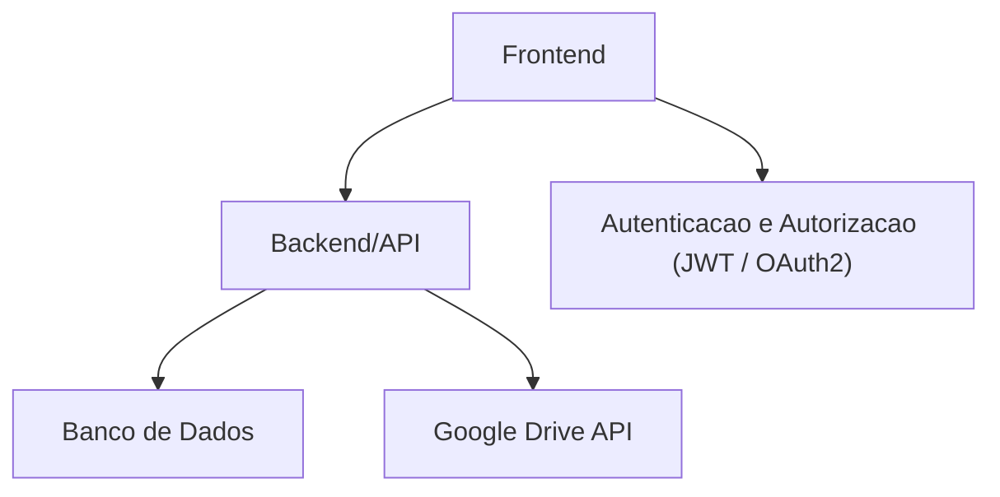

<div align="center">
  
  <h1>📂 Sistema de Gerenciamento de Ativos de Clientes</h1>
  <p>Todas as redes sociais e páginas que faço parte.</p>

  <a href="https://www.youtube.com/@ArchaniaSolum" target="_blank" rel="noopener noreferrer">
    
  </a>
  <a href="https://www.instagram.com/webarchangelo/" target="_blank" rel="noopener noreferrer">
    
  </a>
  <a href="https://www.twitch.tv/zudokan_original" target="_blank" rel="noopener noreferrer">
    
  </a>
  <a href="https://www.linkedin.com/in/juan-lucas-archangelo-061035180/" target="_blank" rel="noopener noreferrer">
    
  </a>
</div>

---

## 📖 Visão Geral

Este projeto tem como objetivo centralizar e organizar **credenciais, arquivos e documentos dos clientes**, oferecendo segurança, praticidade e controle.  
O sistema permite armazenar informações sensíveis de forma segura, além de integrar com serviços externos como o **Google Drive**, para gerenciamento de arquivos e pastas.

---

## 🎯 Objetivos

-   Gerenciar credenciais (usuários, senhas, chaves de acesso) dos clientes.
-   Armazenar e organizar documentos de forma estruturada.
-   Integrar com o **Google Drive** para upload, listagem e exclusão de arquivos.
-   Garantir segurança com autenticação e permissões de acesso.
-   Fornecer uma interface intuitiva para usuários internos.

## 🚀 Tecnologias Utilizadas

<div align="left">
  
  
</div>

---

## 🚀 Funcionalidades

-   [ ] Cadastro e gerenciamento de clientes.
-   [ ] Cadastro seguro de credenciais.
-   [ ] Upload, download e exclusão de arquivos locais.
-   [ ] Integração com Google Drive:
    -   Listar arquivos e pastas.
    -   Criar pastas.
    -   Upload de arquivos.
    -   Excluir arquivos e pastas.
-   [ ] Controle de acesso baseado em perfis (admin, usuário).
-   [ ] Logs de auditoria de acessos e alterações.
-   [ ] Pesquisa avançada por cliente, credencial ou documento.

---

## 🏗 Arquitetura do Sistemaa



---

## 📦 Instalação

```bash
# Clone o repositório
git clone https://github.com/seuusuario/nome-do-projeto.git

# Acesse o diretório
cd nome-do-projeto

# Instale as dependências (exemplo Laravel)
composer install
npm install

# Configure o .env
cp .env.example .env
php artisan key:generate
```
